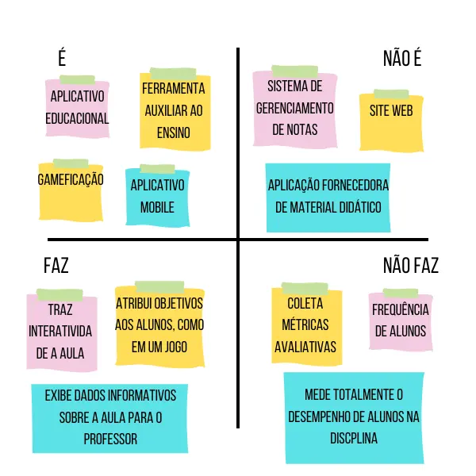

# Primeira elaboração de Artefatos  

Durante essa primeira etapa, elaboramos **três artefatos fundamentais** para a concepção inicial do projeto. São eles:  

- 📄 [Documento de briefing](./briefing.md)  
- 📊 [Pesquisa inicial de mercado](./pesquisa_de_mercado.md)  

Além disso, também desenvolvemos um artefato visual **essencial para o entendimento do produto**, a matriz **"É, Não É"**.  

