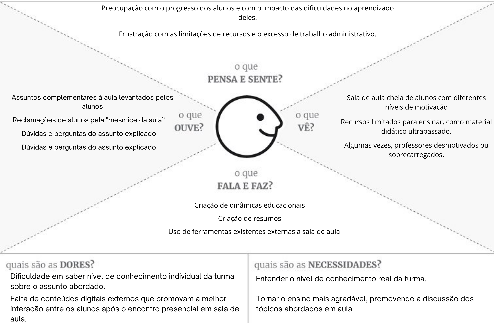

# Segundo Ciclo de Artefatos  

No segundo ciclo, concentramos esforços em criar **dois artefatos fundamentais** para aprofundar o entendimento do produto e de seu público-alvo. Estes artefatos são:  

- 📦 [Caixa do Produto](./caixa_do_produto.md)  
- 👥 [Personas](./personas.pdf)  

Esses materiais foram elaborados com o objetivo de detalhar as características do produto e **representar os perfis principais dos usuários**, guiando o desenvolvimento de maneira mais precisa.

Complementar a essas informações, existe também o **diagrama de empatia**, que neste caso foi criado para o **usuário principal da aplicação**: o **professor**. Este artefato tem o intuito de explorar profundamente as necessidades, dores, ganhos, comportamentos e sentimentos do professor, proporcionando uma visão mais detalhada e humanizada do seu papel e de como ele interage com a aplicação. Esse diagrama é essencial para garantir que a solução criada seja alinhada às expectativas e desafios enfrentados por esse público-alvo.

