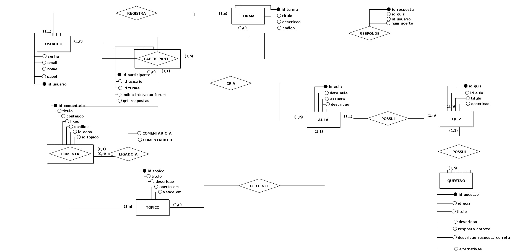

# Quarto e Último Ciclo de Artefatos  

Neste quarto e último ciclo, focado em prototipação, nosso objetivo é estabelecer os **fundamentos finais** para dar início à etapa de produção do projeto. Esta fase é crucial, pois marca a transição do planejamento para a implementação prática. O trabalho será sendo conduzido em **duas frentes principais**:  

1. **Aplicativo Mobile**:  
   Desenvolvido para a **visualização dos dados**, com foco em uma interface amigável, responsiva e intuitiva para atender às necessidades dos usuários.  

2. **Aplicação Backend**:  
   Projetada para lidar com a **lógica de negócio**, integrando o processamento dos dados, garantindo segurança e eficiência na comunicação com o aplicativo mobile.  

Para suportar essas frentes, criamos os seguintes **artefatos finais**:  
### 🔄 Transformação do Flat Backlog em Sprint Backlog
Incluímos a definição de complexidades, priorizações e outras métricas essenciais, organizando o trabalho em sprints estruturadas e alinhadas às metas do projeto.

### 🎨 Wireframe Navegável
Criamos uma representação visual navegável da interface da aplicação mobile, permitindo uma prévia do fluxo de navegação e interação dos usuários. Esse artefato é indispensável para validar a experiência do usuário antes do desenvolvimento completo.

### 📊 Modelo Entidade-Relacionamento (MER) Preliminar
Elaboramos um MER preliminar, detalhando as entidades e seus relacionamentos. Este modelo estabelece a base para o banco de dados e orienta a implementação técnica.

